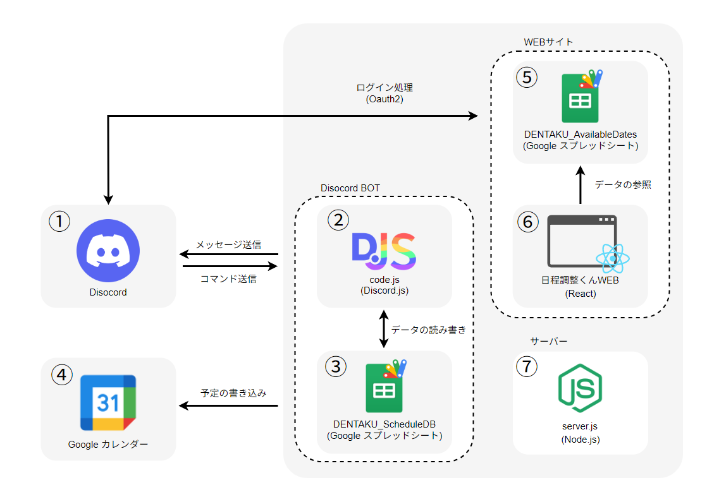

# DENTAKU-BOT (電卓BOT)


## 概要
東京電機大学非電源ゲーム部TRPG部門「電卓」で使用しているスケジュール調整botです。
Discordサーバー向けの多機能スケジュール管理BOTです。
日程調整をサポートする様々な機能を使用することができます。

使用方法は下記Noteでも解説しています。


## Website
今月と前後1ヶ月の空き日程を登録することが可能です。
登録にはDiscordアカウントとの連携が必須です。
[https://dentaku-bot.vercel.app](https://dentaku-bot.vercel.app)

## 主な機能

### スケジュール管理
Discord内のスラッシュコマンドで日程の操作を行うことが可能です。

- **日程追加**: Google Spreadsheetに日程情報を登録
- **日程表示**: Google Spreadsheet・Googleカレンダーへのリンク提供
- **日程削除**: 登録された日程をIDで削除
- **日程修正**: 既存の日程情報を更新
- **日程検索**: 日付・タイトル・KP名・PL名で検索可能

### ダイスロール機能
bcdiceを用いたダイスロールを行うことが可能です。

現在対応済みのシステム一覧：
- **クトゥルフ神話TRPG**
  - CoC 6th
  - CoC 7th
- **シノビガミ**
- **ソードワールド2.5**

汎用ダイスロール・カスタム表も使用可能です。

### その他の機能
- **おみくじ**: ランダムに吉凶を占う
- **ロール選択パネル**: サーバーメンバーがロールを自由に選択・切り替え可能 (管理者のみ使用可能)
- **お知らせ機能**: サーバー全体にお知らせを配信 (管理者のみ使用可能)

## システムアーキテクチャ

DENTAKU-BOTは、Discord、WebUI、Google連携サービスから構成されたマイクロサービスアーキテクチャです。以下、データフローに沿ってシステム全体を説明します。



### ① Discord (ユーザーインターフェース)

**ロール**: メイン入口となるユーザーインターフェース

- ユーザーがコマンドやメッセージを送信する
- BOTと双方向通信を行う
- スラッシュコマンド、メッセージコマンド、ボタンインタラクションに対応

### ② Discord BOT (コア処理エンジン)

**ロール**: メッセージ処理・コマンド実行の中核

**使用技術**: Discord.js, Node.js

- ユーザーからのメッセージとコマンドを受信
- ダイスロール処理をBCDiceで実行
- メッセージ送信とコマンド実行

**ファイル構成**:
```
app/bot/
├── code.js          # メインロジック・イベントハンドラー
└── register.js      # コマンド定義・登録
```

**主な処理**:
- スラッシュコマンド(`/add`, `/delete`, `/search`等)の実行
- ダイスロールコマンド(`coc`, `coc7`, `sinobi`, `SW`等)の処理
- Google Spreadsheet APIへのデータ読み書き指示

### ③ Google Spreadsheet (スケジュール DB)

**ロール**: スケジュール情報の永続的なデータベース

- BOTが管理する全ての日程情報を保存
- マルチユーザー対応で複数の人が同時アクセス可能
- 日程IDで管理し、追加・更新・削除が可能

**データ構造**:
```
DENTAKU_ScheduleDB (Google Spreadsheet)
├── 日程ID
├── 予定日時
├── タイトル
├── KP名
├── PL名
└── その他詳細情報
```

### ④ Google Calendar (スケジュール表示)

**ロール**: スケジュールの一元管理・ビジュアル表示

- Google Spreadsheetのデータを取得
- ユーザーフレンドリーなカレンダー形式で表示
- 予定の書き込みを実施

**活用例**:
- `/show` コマンドで Google Calendar リンクを提供
- Discordユーザーがカレンダーで予定を視覚的に確認可能

### ⑤ React フロントエンド Web UI

**ロール**: Webベースの管理画面・データ閲覧

**使用技術**: React, Vite

- ブラウザからのスケジュール閲覧
- データベースへの読み取り・書き込み操作
- ユーザーが直感的にスケジュール管理できるUI

**ファイル構成**:
```
app/frontend/
├── src/             # Reactコンポーネント・ロジック
├── index.html       # エントリーポイント
└── vite.config.js   # Viteビルド設定
```

**主な機能**:
- 日程一覧の表示
- 日程の追加・編集・削除
- リアルタイム検索・フィルタリング
- Google Spreadsheetのデータとの同期

### ⑥ Express サーバー & API

**ロール**: バックエンドサーバー・API層

**使用技術**: Express, Node.js

- React フロントエンドからのHTTPリクエストを処理
- Google Spreadsheet APIの中継
- OAuth2認証の処理

**ファイル構成**:
```
app/server.js       # Express サーバー・ルーティング
```

**主なエンドポイント**:
```
GET  /api/schedule       # スケジュール一覧取得
POST /api/schedule       # スケジュール追加
PUT  /api/schedule/:id   # スケジュール更新
DELETE /api/schedule/:id # スケジュール削除
GET  /api/search         # スケジュール検索
```

### ⑦ Google Apps Script (GAS) & 外部連携

**ロール**: Google Spreadsheetとの連携・複雑なビジネスロジック処理

- Google Spreadsheetへのデータ書き込み
- Google Calendarの自動更新
- トリガー処理（定期実行等）

---

## 📊 データフロー図

```
[Discord User]
      ↓
  [① Discord]
      ↓
  [② Discord BOT (Node.js)]
      ↓
  ┌─────────────────────────────┐
  ├─→ [③ Google Spreadsheet]   ├─→ [④ Google Calendar]
  │                              │
  ├─→ [⑥ Express Server] ←──────┼─→ [⑤ React Web UI]
  │                              │
  └─→ [⑦ Google Apps Script]   ─┘

[データ読み書き] ←→ [API通信] ←→ [OAuth2認証]
```

---

## 🚀 セットアップ方法

### 前提条件
- Node.js 20.x 以上
- Discordアカウント & サーバー管理権限
- Google Cloud プロジェクト (Spreadsheet API)
- Google Apps Script (GAS)

### インストール

1. **リポジトリのクローン**
```bash
git clone https://github.com/mametin/DENTAKU-BOT.git
cd DENTAKU-BOT
```

2. **依存関係のインストール**
```bash
npm install
cd app && npm install
cd frontend && npm install && cd ../..
```

3. **環境変数の設定**

`.env` ファイルを作成し、以下の環境変数を設定します：

```env
# Discord BOT
DISCORD_BOT_TOKEN=your_discord_bot_token

# Google 認証情報
GOOGLE_SERVICE_ACCOUNT_EMAIL=your_service_account_email
GOOGLE_PRIVATE_KEY=your_private_key
GOOGLE_SPREADSHEET_ID=your_spreadsheet_id
```

### 開発サーバー起動

```bash
# バックエンド（Express + Discord BOT）
npm run dev

# フロントエンド（別ターミナルで実行）
cd app/frontend
npm run dev
```

### 本番環境での起動

```bash
npm start
```

## 主な依存関係

| パッケージ | 用途 |
|----------|------|
| `discord.js` | Discord BOT フレームワーク |
| `bcdice` | ダイスロール処理 |
| `express` | Webサーバー & API |
| `google-spreadsheet` | Google Spreadsheet API クライアント |
| `google-auth-library` | Google 認証 |
| `axios` | HTTP クライアント |
| `react` | フロントエンド (UI フレームワーク) |
| `vite` | フロントエンド ビルドツール |

## コマンド一覧

| コマンド | 説明 |
|--------|------|
| `/hello` | ユーザーに挨拶 (日本語/英語) |
| `/add` | 新しい日程を追加 |
| `/show` | Spreadsheet・Googleカレンダーのリンク表示 |
| `/delete` | IDを指定して日程を削除 |
| `/correct` | IDを指定して日程を修正 |
| `/search` | 日付・タイトル・KP名・PL名で日程を検索 |
| `/omikuji` | おみくじを引く |
| `/notice` | お知らせを配信 (管理者限定) |
| `/setup_roles` | ロール選択パネルを生成 (管理者限定) |

### ダイスロールコマンド

メッセージで以下のコマンドを送信すると、ダイスが自動的にロールされます：

```
coc <ロール式>      # CoC 6th Edition
coc7 <ロール式>     # CoC 7th Edition
sinobi <ロール式>   # シノビガミ
SW <ロール式>       # ソードワールド2.5
<ロール式>          # 汎用ダイスロール (DiceBot)
table <表定義>      # カスタム表のロール
```

**例:**
```
coc 1d100<=60
coc7 2d6+2
sinobi 4d10
SW 2d6
1d20+5
choice[赤,青,緑]
```

## Docker での実行

```bash
docker build -t dentaku-bot .
docker run --env-file .env dentaku-bot
```

## プロジェクト構成

```
DENTAKU-BOT/
├── app/
│   ├── bot/
│   │   ├── code.js           # Discord BOT メインロジック
│   │   └── register.js       # コマンド登録
│   ├── frontend/             # React フロントエンド
│   │   ├── src/              # ソースコード
│   │   ├── index.html
│   │   └── vite.config.js
│   ├── server.js             # Express サーバー & API
│   └── package.json
├── Dockerfile                # Docker設定
├── package.json              # ルートディレクトリの依存関係
└── README.md                 # このファイル
```

## License

このプロジェクトはMITライセンスの下で公開されています。

## Issues & Contributions

不具合報告や機能提案は、
[GitHub Issues](https://github.com/mametin/DENTAKU-BOT/issues) もしくは
[日程調整くん問い合わせフォーム](https://docs.google.com/forms/d/e/1FAIpQLSdnyWu4jT7FPyFUg6qVreQqlCgD7YuBAUg2zcrWtQ4zCN7AvA/viewform)
までお願いします。

## Contact

`mamerugon [at] gmail.com`

---

**Last Updated:** 2026-06-16
